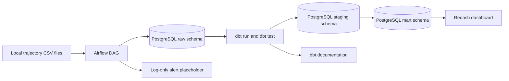

# Tech-Stack Flow Diagram Placeholder

```mermaid
flowchart LR
    CSV[Local trajectory CSV files] --> Airflow[Airflow DAG]
    Airflow --> Raw[(PostgreSQL raw schema)]
    Raw --> dbt[dbt run and dbt test]
    dbt --> Staging[(PostgreSQL staging schema)]
    Staging --> Mart[(PostgreSQL mart schema)]
    Mart --> Redash[Redash dashboard]
    dbt --> Docs[dbt documentation]
    Airflow --> Alerts[Log-only alert placeholder]
```

Replace this placeholder with a rendered architecture diagram if a static image is required for review.
